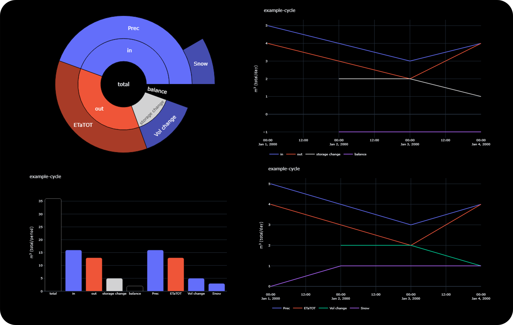

# Cycles
# Quick setup
```
├── flowplot
    ├── user-inputs
        ├── cycles
            ├── example-cycle.csv
        └── time-series
            ├── example-time-series.csv
```
```python
# inside flowplot
cycle(  'user-inputs\cycles\example-cycle.csv',  delimiter=';')
```
### example-cycle.csv
| SIMULATION | VARIABLES | UNITS | TYPE |
| --- | --- | --- | --- |
| .\user-inputs\time-series\example-time-series.csv | Prec | m3 | in |
| | ETaTOT | m3 | out |
| | Vol | m3 | storage |
| | Snow | m3 | Prec |

### example-time-series.csv
| YYYY | MM | DD | Prec | ETaTOT | Vol | Snow |
| ---  |--- |--- |---|---| ---|---|
| 2000 | 01 | 01 | 5 | 4 | 20 | 0 |
| 2000 | 01 | 02 | 4 | 3 | 22 | 1 |
| 2000 | 01 | 03 | 3 | 2 | 24 | 0 |
| 2000 | 01 | 04 | 4 | 4 | 25 | 1 |



# User inputs
User inputs include csv files organised into two folders:
- cycles
- time-series

## cycles
csv files organise the flow variables to be included, detailing the path to the flow time-series, name of the variable, unit, and type (in, out, storage, or sub-variable).
Cycle csv files include four columns: SIMULATION, VARIABLES, UNITS, TYPE
- SIMULATION is the path, relative or absolute, to the csv file holding the flow time-series. If it is the same path as the variable above, it can be left empty.
- VARIABLES is the name of the flow variable in the file pointed to in SIMULATION
- UNITS is the unit of the variable, ex., m3, m3s, m3d, etc. discussed below
- TYPE is either *in*, *out*, *storage*, or the *name of a variable* included in one of the above lines, implying it is a sub-flow of this variable

### Units 
Flow values will be transformed into metres cubed per day or metres per day.
Stock values will be transformed into metres cubed or metres (daily average). 

| unit    | description                              |
| ------- | ---------------------------------------- |
| m3      | cubic metres (volume, per day)           |
| m3s     | cubic metres per second (flow rate)      |
| mm      | millimetres (depth per cell, per day)    |
| --cell  | multilpies by the number of cells        |
| --domain| divides the unit by the number of cells and (average) cell size |

### Example Cycles file 
| SIMULATION | VARIABLES | UNITS | TYPE |
| --- | --- | --- | --- |
| ..\Location\basin.ts | Prec | mmdcell | in |
| | ETaTOT | m3dcell | out |
| | Vol | m3cell | storage |
| ..\Location\outlet.ts | QChan | m3s | out |

## time-series
Files contains three columns for the date: YYYY, MM, DD.
Column names must include those indicated in the cycles csv VARIABLES column above. Columns hold daily values of flows, with name and unit indicated in cycle csv.

### Example time-series file 
| YYYY | MM | DD | Prec | ETaTOT | Vol | NotUsed |
| --- | --- | --- | --- | --- | --- | --- |
| 2000 | 01 | 01 | 7.89E+00 | 4.74+03 | 2.43E+06 | 1.77E+11 |
| 2000 | 01 | 01 | 6.19E+00 | 3.85E+03 | 2.43+06 | 1.77E+11 |

# Usage

Cycles include the following visualizations: Circle chart, Bar chart, Overall Line graph, and Flow-specific Line graph.

**Function options:**
- `filename`: Path to the Cycles csv file arranging the cycle.
- `cellsize_m2`: Cell size (average) in square metres.
- `num_cells_domain`: Number of cells in the domain.
- `return_figures`: If `True`, returns the figures as four function outputs instead of displaying them.
- `onlyCircle`: If `True`, returns only the Circle chart.
- `onlyTypeFlows`: If `True`, returns only the Overall Line graph.
- `margins`: If `True`, shows figures with margins.
- `delimiter`: Delimiter of the csv file.

**Example usage and default options**
```python
cycle(  filename, 
        cellsize_m2=1000*1000, 
        num_cells_domain=153451, 
        return_figures=False, 
        onlyCircle=False, 
        onlyTypeFlows=False, 
        margins=True,
        delimiter=';')
```

**Cells with different sizes**

In the future, we will read in NetCDF files. For now, they must be converted into csv files. The time series csv files should all be harmonised in terms of the area they represent. For example, all units represent the total cubic metres over the entire area per day. Evapotranspiration would then be the total cubic metres over all cells per day. Discharge at the outlet would be the total cubic metres *at the outlet* per day. 


# Outputs

The function creates the following diagrams for a user-defined cycle:
- **Circle chart:** Shows partitioned inputs, outputs, net storage changes, and balance, aggregated over space and time.
- **Bar chart:** Shows partitioned inputs, outputs, net storage changes, and balance, aggregated over space and time.
- **Overall Line graph:** Shows inputs, outputs, net storage changes, and balance through time, aggregated spatially.
- **Flow-specific Line graph:** Shows partitioned flows through time, aggregated spatially.